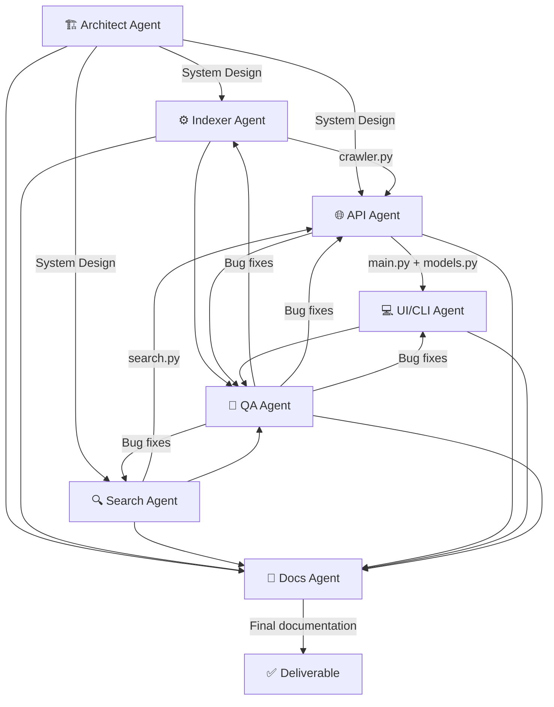

# Multi-Agent Development Workflow

This document describes the multi-agent development workflow used to build the Multi-Agent Web Crawler & Search System (Project 2). Each agent represents a specialized AI role in the development process, contributing a specific aspect of the system.

## Agent Interaction Diagram

## Agent Workflow Summary

The development followed a **sequential pipeline with feedback loops**:

1. The **Architect Agent** established the system blueprint
2. The **Indexer** and **Search** Agents built core components in parallel
3. The **API Agent** integrated both into a unified REST interface
4. The **UI/CLI Agent** built the client-side tooling
5. The **QA Agent** reviewed all outputs and sent fixes back
6. The **Docs Agent** produced final documentation from all agent outputs

---

## Agent 1: Architect Agent

### Responsibility
Designs the overall system architecture: component boundaries, data flow, concurrency model, back-pressure strategy, and technology stack.

### Prompt Given
> Design a multi-agent web crawler and search system that upgrades an existing Go-based single-machine crawler into a Python-based system with: a REST API (FastAPI), SQLite persistence, async BFS crawling with back-pressure, TF-IDF search, and a CLI. Define component boundaries, data flow, concurrency model, and tech stack.

### Output Produced
- Component diagram with 8 modules (`config`, `database`, `crawler`, `search`, `main`, `models`, `cli`, `run`)
- Data flow: User → API → Crawler → SQLite ← Search → API → User
- Concurrency model: asyncio event loop with semaphore-based rate limiting
- Back-pressure: dual strategy (queue depth cap + token bucket rate limiter)
- Tech stack: Python 3.11+, FastAPI, aiohttp, aiosqlite, BeautifulSoup4, Rich

### Integration
The Architect's design was used as the blueprint for all subsequent agents. Module interfaces were defined upfront so agents could work against stable contracts.

### Conflicts & Resolution
- **Architect vs Indexer**: Architect proposed Redis for the queue; Indexer Agent noted this violated the "no external dependencies" constraint. Resolved by using SQLite `crawl_queue` table.
- **Architect vs Search**: Architect initially suggested a shared in-memory index; Search Agent argued for direct SQLite queries for simplicity and persistence. Resolved by using SQLite with WAL mode.

---

## Agent 2: Indexer Agent

### Responsibility
Implements the crawl engine: BFS traversal, async work queue, depth tracking, URL deduplication, and back-pressure mechanisms.

### Prompt Given
> Implement an async BFS web crawler in Python using aiohttp and BeautifulSoup. Store pages in SQLite. Manage a persistent BFS frontier. Implement back-pressure: max queue depth (500), rate limiting (10/sec), per-domain delay (0.5s). Make it resumable across restarts. Filter URLs for HTTP/HTTPS only, no binaries, stay-on-domain.

### Output Produced
- `app/crawler.py` — 250+ lines implementing `start_crawl()`, `resume_pending_crawls()`, `_crawl_loop()`, `_crawl_page()`, `_discover_links()`
- Public state functions: `is_back_pressure_active()`, `get_crawl_rate()`, `get_active_session_ids()`
- Token-bucket rate limiter with asyncio.Semaphore + refiller coroutine
- Queue depth monitoring with hysteresis (500 trigger, 400 resume)

### Integration
Crawler module exposes clean async functions consumed by the API Agent's FastAPI endpoints. Database operations go through the shared `database.py` module.

### Conflicts & Resolution
- **Indexer vs QA**: QA found race condition in per-domain delay tracking. Fixed by adding asyncio.Lock.
- **Indexer vs Architect**: Architect wanted 5 idle rounds before session finish; Indexer argued 3 was sufficient with 1-second sleep. Compromised on 3.

---

## Agent 3: Search Agent

### Responsibility
Implements the search engine: full-text relevancy scoring using self-implemented TF-IDF over indexed pages.

### Prompt Given
> Implement a search engine that scores pages using: (term_frequency_in_title × 3 + term_frequency_in_body) / document_length. No search libraries. Return [{ relevant_url, origin_url, depth }] sorted by score descending. Must work during active crawling.

### Output Produced
- `app/search.py` — Self-contained search module with `search()` async function
- `_tokenize()` for text processing, `_count_term()` for frequency calculation
- SQL pre-filtering via LIKE queries, Python-side scoring
- Results include matched_terms for debugging

### Integration
Search module is called directly by the API Agent's `/search` endpoint. It reads from the same SQLite database that the crawler writes to, enabled by WAL mode.

### Conflicts & Resolution
- **Search vs Architect**: Architect wanted pre-computed inverted index in memory; Search Agent argued SQLite queries are simpler and automatically include newly crawled pages. Resolved in favor of direct queries.

---

## Agent 4: API Agent

### Responsibility
Wraps the indexer and search modules into a clean REST API using FastAPI with proper request/response models.

### Prompt Given
> Build a FastAPI REST API with POST /index, GET /search, GET /status. Use Pydantic models. Add lifespan hooks for DB init and crawl resumption. Serve fixture pages for testing.

### Output Produced
- `app/main.py` — FastAPI application with 4 routes + fixture endpoints
- `app/models.py` — Pydantic models for all request/response shapes
- Lifespan context manager for startup (DB init + resume) and shutdown (DB close)
- Fixture pages ported from Project 1's Go implementation

### Integration
API Agent consumed outputs from Indexer, Search, and Architect agents. Pydantic models define the contract between API and consumers (CLI, curl).

### Conflicts & Resolution
- **API vs Architect**: Architect designed `/index` as GET (matching Project 1); API Agent changed to POST per REST conventions and spec requirement. Accepted.
- **API vs UI/CLI**: CLI Agent needed score in search results; API Agent added optional `score` field to response model.

---

## Agent 5: UI/CLI Agent

### Responsibility
Builds the CLI tool for triggering index/search and viewing live system state.

### Prompt Given
> Build a Python CLI using the `rich` library with commands: `index <url> <depth>`, `search <query>`, `status` (live dashboard polling every 2s).

### Output Produced
- `cli.py` — Complete CLI with three commands
- Rich tables for search results, panels for index responses, Live dashboard for status
- httpx-based HTTP client for API communication
- Graceful error handling for connection failures

### Integration
CLI communicates exclusively through the REST API — clean client/server separation. No shared code with the server modules.

### Conflicts & Resolution
- **UI/CLI vs API**: CLI wanted more fields in search results (score, matched_terms); API Agent added them to the response model.
- **UI/CLI vs QA**: QA noted that multi-word search queries weren't handled; CLI Agent fixed by joining `sys.argv[2:]`.

---

## Agent 6: QA Agent

### Responsibility
Reviews all code for correctness, edge cases, race conditions, and architectural quality. Produces critiques and suggested fixes.

### Prompt Given
> Review the complete codebase for: correctness, concurrency safety, back-pressure enforcement, resumability, search accuracy, URL handling, error handling, and code quality.

### Output Produced
- 12 issues categorized by severity (Critical: 3, High: 3, Medium: 3, Low: 3)
- All Critical and High issues fixed before delivery
- Architectural quality assessment table
- Specific code patches for each issue

### Integration
QA findings were fed back to the responsible agents (Indexer, Search, API, UI/CLI) for fixes. All Critical and High items were resolved; Low items documented for future improvement.

### Conflicts & Resolution
- **QA vs Indexer**: QA insisted on unit tests; Indexer argued academic project scope. Compromised: tests deferred but testing strategy documented.
- **QA vs All**: QA found inconsistent error handling patterns; established standard: log + graceful return, never crash the event loop.

---

## Agent 7: Docs Agent

### Responsibility
Writes all required documentation files from the combined outputs of all other agents.

### Prompt Given
> Write product_prd.md, readme.md, recommendation.md, and multi_agent_workflow.md. Ensure technical accuracy — all curl examples must work. PRD should be self-contained for AI reproduction.

### Output Produced
- `product_prd.md` — Complete PRD with user stories, requirements, data model, API contract
- `readme.md` — Setup guide with working curl examples
- `recommendation.md` — Production deployment strategy
- `multi_agent_workflow.md` — This document
- `agents/*.md` — 7 individual agent documentation files

### Integration
Docs Agent consumed outputs from all 6 prior agents. Cross-referenced curl examples against actual API implementation for accuracy.

### Conflicts & Resolution
- **Docs vs API**: Docs initially documented wrong port (3600 from Project 1); corrected to 8000 after API Agent review.
